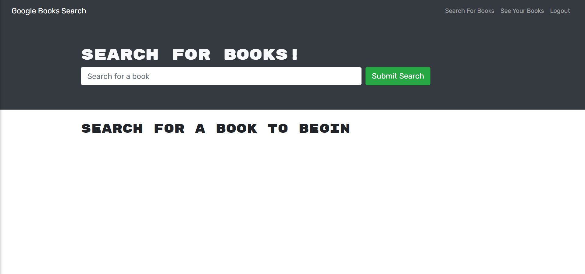

# Book-Search 

# Badges

  ## Description
A fully functioning Google Books API search engine built with a GraphQL API built with Apollo Server. The app was built using the MERN stack, with a React front end, MongoDB database, and Node.js/Express.js server and API.

 ## Usage
 As an avid reader the user can search for new books to read. Once the user has found a book they would like to purchase they can store the book in their personal profile.

  <!-- ## Table of Contents

  * [Pcitures](#pictures)
  * [License](#license)
  * [Credits](#credits) -->

  
  ## Pictures

  
  

  ## <a href="https://book-search-ds.herokuapp.com/">LIVE ON HEROKU</a>

      
  ## License
  MIT
   
  [See MIT License](https://choosealicense.com/licenses/mit)

 ## Credits
    
  Contributor: Darryl Simpson  
  GitHub: https://github.com/DarrylSimpson